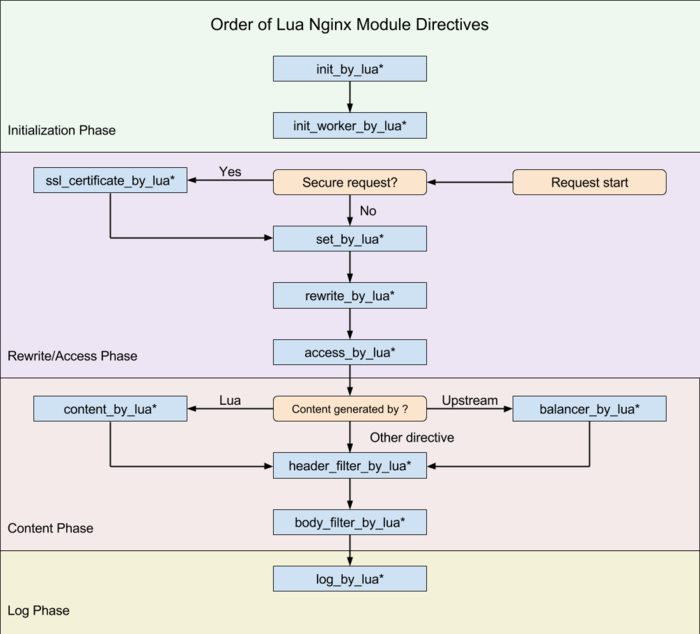

# openresty-classic

## 项目介绍
openresty做网关用 经典用法

#### 架构图
###### 时序图 架构图暂未画

###### eopenresty架构图


#### openresty各个阶段
1. set_by_lua*: 流程分之处理判断变量初始化
2. rewrite_by_lua*: 转发、重定向、缓存等功能(例如特定请求代理到外网)
3. access_by_lua*: IP准入、接口权限，认证等情况集中处理(例如配合iptable完成简单防火墙)
4. content_by_lua*: 内容生成
5. header_filter_by_lua*: 响应HTTP头过滤处理(例如添加头部信息)
6. body_filter_by_lua*: 应答BODY过滤处理(例如完成响应内容统一成大写)
7. log_by_lua*: 回话完成后本地异步完成日志记录(日志可以记录在本地，还可以同步到其他机器)

#### 代码结构
1. conf/conf.inner是用户自定义的nginx配置部分。
2. app.map是用户需要配置的地方。根据app名称，分别设置转发的路由，认证，生成内容，输出过滤，记录日志，可配置。
3. lua/是用户自定义逻辑的地方，各个子目录access|content|log等分别存放不同阶段的lua处理脚本。

写好脚本后再app.map配置

## 安装教程

1. 依赖组件

	yum install pcre-devel openssl-devel gcc curl

2. 可以在 RHEL 系统中添加 openresty 仓库

	yum install yum-utils
	yum-config-manager --add-repo https://openresty.org/package/centos/openresty.repo

3. 安装

	yum install openresty
	yum install openresty-resty  (可选，命令行工具)

## 启动/重启
1. service/systemctl方式
```
service openresty start
service openresty restart
service openresty stop
```

2. openresty方式
```
openresty      ( openresty -p /etc/openresty/ )
openresty -s reload   ( openresty -s reload -p /etc/openresty/ )
openresty -s stop
```

## 错误状态码

* 401表示认证未通过，未携带token或者token过期
* 403表示授权未通过，没有权限访问此服务
* 500服务器内部错误，网关内部出错或者app内部出错
* 502网关错误，app未启动或者完全无法访问
* 503服务没有注册，即app未能注册到app.map
* 504网关超时，即app可以访问，响应超时

## 参与贡献

1. openresty 中文官网 https://openresty.org/cn/
2. ngx_lua API 文档https://github.com/openresty/lua-nginx-module
3. lua-resty-http插件https://github.com/pintsized/lua-resty-http
